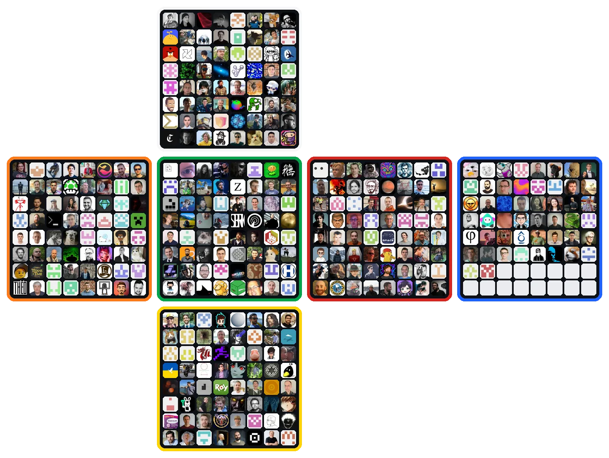

# Rubik's Rubrics

A stunning (if I do say so myself), self-contained 3D Rubik's Cube visualizer and solver. A scrambled cube appears,
then solves itself with smooth, eased layer-turn animations... and you control the show.

**▶ Live demo:** https://leereilly.net/rubiks-rubriks/


 

## Features

- **Random scramble** — the cube shows up in a random state every time.
- **Scan a real cube** — enable your webcam, hold up a physical cube face by face,
  and the browser reads the colors, shows the detected layout as an editable net
  (tap to correct any misreads), then solves it so you can watch it unscramble.
- **Animated solve** — watch it unscramble with buttery, eased quarter-turn animations.
- **Speed slider** — go from a slow crawl to turbo.
- **Timeline scrubber + transport** — scrub anywhere between *Scrambled* and *Solved*,
  step a single move back/forth, jump to either end, or play/pause.
- **GitHub contributions mode** — repaint the stickers as GitHub contribution-graph
  squares (those familiar greens).
- **Auto-rotate**, orbit (drag), and zoom (scroll) for a showcase feel.
- **Stunning rendering** — physically based glossy stickers, image-based reflections,
  soft contact shadows, and subtle bloom.

## How it works

The cube starts solved, then a random sequence of quarter turns scrambles it. The
solution is simply that sequence **reversed and inverted**, so every solve is valid by
construction — no solver library required. State is tracked as a small logical model
(each cubie's grid position + orientation quaternion), which keeps scrubbing
frame-perfect and drift-free.

A cube you **scan** with your webcam can be in any state, so that path uses a real
solver: [cubejs](https://github.com/ldez/cubejs) (Herbert Kociemba's two-phase
algorithm) runs in a Web Worker, loaded straight from a CDN. All 54 stickers are matched
against the six scanned center colors in a hue/saturation space (brightness is ignored, so
glare and uneven lighting don't wash them out) and then balanced so each color appears
exactly nine times — which fixes systematic misreads like red-vs-orange and guarantees a
legal cube. The solution it returns is fed through the same reverse-and-invert machinery,
and the visualizer plays it back.

## Running locally

It's a single `index.html` with no build step. Because it uses ES module imports from a
CDN, open it via a local server (not `file://`):

```bash
python3 -m http.server 8000
# then visit http://localhost:8000
```

## Tech

[Three.js](https://threejs.org/) (WebGL) — `RoundedBoxGeometry`, `OrbitControls`,
`RoomEnvironment`, and `UnrealBloomPass`, all loaded from a CDN via an import map.

## Open source credits

Rubik's Rubrics stands on the shoulders of two wonderful open source projects:

- **[three.js](https://github.com/mrdoob/three.js)** (MIT) — the WebGL engine behind every
  rendered frame: `RoundedBoxGeometry`, `OrbitControls`, `RoomEnvironment`, `EffectComposer`,
  and `UnrealBloomPass`.
- **[cubejs](https://github.com/ldez/cubejs)** (MIT) — Herbert Kociemba's two-phase solver,
  used to solve cubes scanned from your webcam.

Thank you to **every single person** who has contributed to them. Each sticker on the faux
Rubik's cube below is the GitHub avatar of one of the **370 contributors** to those two
projects — deduplicated, so nobody appears twice. The leftover stickers wear GitHub's
contribution-graph gray. ✊

<p align="center">
  
</p>

---

Made with ♥ and [GitHub Copilot](https://github.com/features/copilot) and Claude Opus 4.8 · max :metal:
